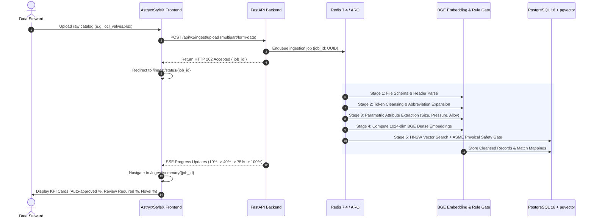
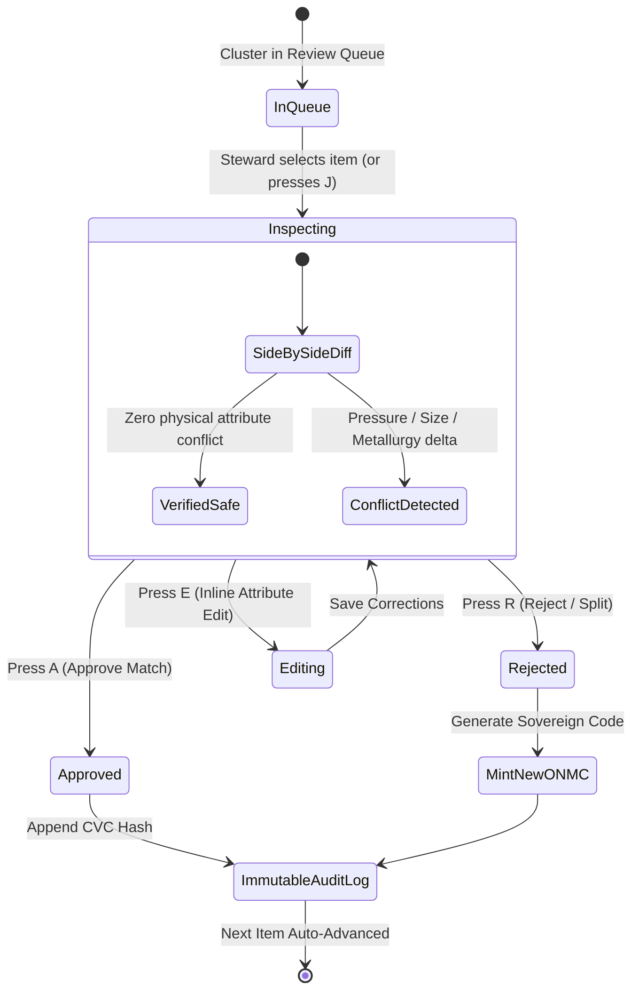

# Application Flow & Navigation Architecture (APP_FLOW.md)

## National Unified Material Master (NUMM) Framework

**Problem Statement**: SIH 26099 (Ministry of Petroleum & Natural Gas - MoPNG)  
**Standard**: One Nation, One Material Code (ONMC)  
**Version**: 2.2.0 (Enterprise Specification)

---

## 1. System Entry Points & Authentication Architecture

### 1.1. Primary Enterprise Single Sign-On (SSO)

- **Protocol**: SAML 2.0 / OAuth2 OpenID Connect via National Informatics Centre (NIC) MeghRaj SSO and CPSE Corporate Active Directories (IOCL, ONGC, BPCL, HPCL, GAIL).
- **Role-Based Landing**:
  - _Data Steward_: Lands on `/steward/dashboard` (active review queues, confidence score distribution).
  - _Procurement Officer_: Lands on `/procurement/dashboard` ("Search Before Buy", pooled demand aggregations).
  - _Plant Maintenance Engineer_: Lands on `/search` (emergency spare discovery, surplus stock lookup).
  - _MoPNG / CVC Auditor_: Lands on `/audit/overview` (immutable decision hash ledger, catalog rationalization KPIs).

### 1.2. Automated ERP Ingestion Pipelines

- **Protocol**: Mutual TLS (mTLS) REST API (`POST /api/v1/ingest/batch`) with API Key authentication for scheduled nightly ERP batch synchronization from SAP ECC, SAP S/4HANA, and Oracle EBS.

---

## 2. Core User Flows & State Transitions

### Flow 1: Catalog Ingestion & Automated Normalization

**Goal**: Upload legacy unstandardized catalog dumps, execute NLP extraction, vector embedding, and rule gating.  
**Path**: `/ingest` → `/ingest/status/{job_id}` → `/ingest/summary/{job_id}`

---

### Flow 2: High-Throughput HITL Stewardship Triage

**Goal**: Review, validate, and resolve borderline match candidate pairs (70% - 91% confidence).  
**Path**: `/steward/queue` → `/steward/cluster/{cluster_id}`

---

### Flow 3: "Search Before Buy" Pre-Procurement Discovery

**Goal**: Prevent duplicate purchases by querying national holdings before floating a tender or purchase requisition.  
**Path**: `/search` → `/search/item/{onmc_code}`

1. **User Action**: Procurement officer enters free-text query (e.g., `2 inch 150# flanged ball valve CS A105`).
2. **System Action**:
   - Executes dense vector embedding on query text.
   - Performs hybrid HNSW vector search (`pgvector`) combined with exact metadata filtering on `size_inch = 2.0` and `pressure_class = 150`.
   - Fetches matching canonical ONMC record: `ONMC-MECH-VLV-BAL-002-150-A105-9B2F`.
   - Aggregates live warehouse stock across all participating CPSEs (IOCL, ONGC, BPCL, HPCL).
   - Surfaces GeM catalog direct requisition link and cross-walked Shell MESC (`74.16.01.015.1`) and UNSPSC (`40141607`) codes.
3. **Outcome**: Officer discovers ONGC Hazira holds 14 unallocated units in insurance surplus stock 80 km away, eliminating a ₹4.2 Lakh purchase order and 16-week supplier wait.

---

### Flow 4: Inter-CPSE Surplus Stock Discovery & Transfer

**Goal**: Request and execute emergency inter-company material transfer between neighboring CPSE plants.  
**Path**: `/surplus` → `/surplus/transfer-request/{id}`

1. **Selection**: User clicks "Initiate Inter-CPSE Transfer" on available surplus inventory card.
2. **Transfer Form**:
   - System auto-populates source plant (ONGC Hazira), destination plant (IOCL Gujarat Refinery), distance (78 km), and book valuation price.
   - Generates MoPNG standard Material Transfer Inter-Company Requisition Form (MTIRF).
3. **Approval Chain**: Source CPSE materials manager approves digitally via e-Sign / Aadhaar OTP.
4. **ERP Sync**: Generates outbound delivery note in source SAP system (`VL01N`) and inbound purchase order in receiving SAP system (`ME21N`).

---

### Flow 5: Pooled Demand Joint Procurement Aggregation

**Goal**: Aggregate scheduled procurement needs across multiple CPSEs into pooled national tenders to secure volume discounts.  
**Path**: `/procurement/pooled-demand`

1. **Scanning**: Background job aggregates active annual procurement projections across CPSEs for identical ONMC items.
2. **Clustering**: Groups common commodities (e.g., 2" Ball Valves: IOCL needs 1,200 units, BPCL needs 850 units, HPCL needs 900 units). Total pooled demand = 2,950 units.
3. **Discount Curve**: Automatically computes expected volume savings (e.g., 14.2% cost reduction = ₹1.14 Crore saved).
4. **Tender Export**: Generates GeM-ready unified tender specification document compliant with CVC and MoPNG guidelines.

---

## 3. Error States & Edge Case Protocols

| Error / Edge Case                       | Trigger Condition                                                                     | System Behavior & User Recovery                                                                                                                                                    |
| --------------------------------------- | ------------------------------------------------------------------------------------- | ---------------------------------------------------------------------------------------------------------------------------------------------------------------------------------- |
| **E-01: Incompatible Pressure Rating**  | Raw description specifies Class 300 while candidate master is Class 150.              | Hard rule gate halts automated merge. UI paints attribute row in Crimson Wine (`#9B121E`). Action button locks to "Split / Mint New Code".                                         |
| **E-02: Missing Critical Metallurgy**   | Description states `2 INCH 150# BALL VALVE` with no metallurgy grade specified.       | System assigns `metallurgy: UNKNOWN` and routes to data steward with amber alert: "Mandatory Engineering Attribute Missing. Select Metallurgy to Proceed."                         |
| **E-03: Corrupt Header / Encoding**     | Uploaded catalog contains non-UTF8 encoding or unmapped column headers.               | Ingestion engine automatically applies `ftfy` / `chardet` encoding repair. If headers missing, launches visual column mapping modal.                                               |
| **E-04: Split-Brain Duplicate Cluster** | Two stewards simultaneously review conflicting records in the same duplicate cluster. | PostgreSQL row-level locking (`SELECT ... FOR UPDATE`) prevents race condition. Second steward receives graceful toast notification: "Cluster already resolved by user R. Sharma." |
