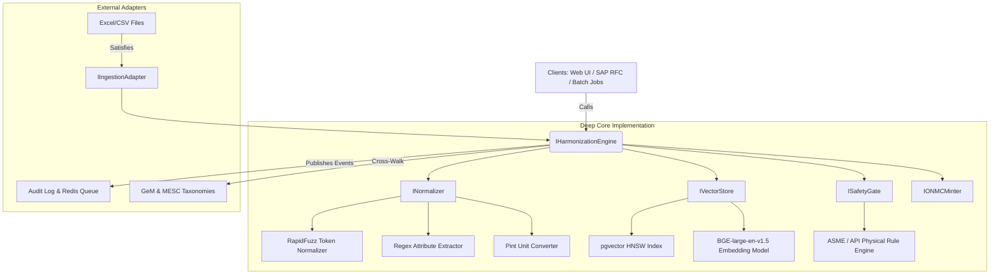

# Deep Module Architecture & Seam Design (ARCHITECTURE.md)

## National Unified Material Master (NUMM) Framework

_Architectural design adhering to Deep Module Principles (`.agents/skills/codebase-design`)_

---

## 1. Architectural Philosophy: Deep Modules & High Caller Leverage

In high-consequence enterprise applications like public sector material master management, architecture must prioritize **depth**:

- **Deep Modules**: Minimal, intuitive surface area (small interfaces) hiding extensive, intricate domain behavior (deep implementations).
- **Clean Seams**: Explicit locations where behavior can be adapted or replaced without modifying caller code.
- **Locality**: Complex changes, safety rules, and validation concentrate inside single modules rather than leaking across consumers.

```
┌────────────────────────────────────────────────────────┐
│                   Small Interface                      │
│   e.g. harmonize_item(raw_text) -> HarmonizedResult    │
├────────────────────────────────────────────────────────┤
│                 Deep Implementation                    │
│   - Domain dictionary token cleansing                  │
│   - Parametric regex extraction (Size, Class, Alloy)   │
│   - Metric-Imperial unit conversion (Pint)             │
│   - BGE 1024-dim dense vector generation               │
│   - HNSW Cosine vector distance query                  │
│   - Physical engineering safety rule evaluation        │
│   - Bi-directional MESC (10-digit) & UNSPSC cross-walk │
│   - Deterministic ONMC national code minting           │
└────────────────────────────────────────────────────────┘
```

---

## 2. Core Seams & Interface Specifications

### 2.1. Ingestion Seam (`IIngestionAdapter`)

Separates raw enterprise file parsing and format nuances from core normalization logic.

```python
from abc import ABC, abstractmethod
from typing import List, BinaryIO, Dict, Any
from dataclasses import dataclass

@dataclass(frozen=True)
class RawMaterialLine:
    source_org: str          # e.g., "IOCL", "ONGC"
    source_item_code: str    # e.g., "10294819"
    raw_description: str     # e.g., "VLV BL FLGD 50MM 150# CS A105"
    plant_code: str          # e.g., "1100" (Mathura Refinery)
    unit_price: float        # e.g., 28500.0
    uom: str                 # e.g., "EA", "NO", "MTR"
    metadata: Dict[str, Any] # Additional SAP fields (MARA/MARC)

class IIngestionAdapter(ABC):
    """Deep module seam for file parsing and ERP data extraction."""

    @abstractmethod
    def parse_stream(self, stream: BinaryIO, filename: str, org_code: str) -> List[RawMaterialLine]:
        """Parses any supported tabular format (.xlsx, .csv, SAP flat file)."""
        pass
```

### 2.2. Normalization & Extraction Seam (`INormalizer`)

Encapsulates token cleaning, abbreviation expansion, and physical attribute extraction behind a single call.

```python
@dataclass(frozen=True)
class ExtractedAttributes:
    clean_text: str
    item_class: str            # "BALL_VALVE", "WELD_NECK_FLANGE", etc.
    size_inch: float | None    # 2.0
    size_mm: int | None        # 50
    pressure_class: int | None # 150
    metallurgy: str | None     # "ASTM_A105"
    end_connection: str | None # "FLANGED_RF"
    standards: List[str]       # ["API_6D", "ASME_B16.5"]
    mesc_subgroup: str | None  # "74.16"
    unspsc_code: str | None    # "40141607"

class INormalizer(ABC):
    """Deep module: Small interface, deep parsing logic."""

    @abstractmethod
    def normalize_and_extract(self, raw_text: str) -> ExtractedAttributes:
        """Transforms dirty legacy description into structured engineering attributes."""
        pass
```

### 2.3. Safety Rule Gate Seam (`ISafetyGate`)

Enforces hard physical constraints. Zero tolerance for engineering hazards.

```python
@dataclass(frozen=True)
class GateEvaluation:
    passed: bool
    rejection_reasons: List[str]
    criticality: str  # "BLOCKER", "WARNING", "CLEAN"

class ISafetyGate(ABC):
    """Deep safety seam: evaluates pressure, size, and metallurgy compatibility."""

    @abstractmethod
    def evaluate(self, candidate: ExtractedAttributes, reference: ExtractedAttributes) -> GateEvaluation:
        """Determines if candidate can safely match or substitute reference."""
        pass
```

### 2.4. Matching & Harmonization Seam (`IHarmonizationEngine`)

High-leverage coordinator providing complete catalog resolution.

```python
@dataclass(frozen=True)
class MatchCandidate:
    unified_code: str          # "ONMC-MECH-VLV-BAL-002-150-A105-9B2F"
    confidence_score: float    # 0.945 (94.5%)
    lexical_similarity: float  # 0.920
    semantic_similarity: float # 0.970
    gate_result: GateEvaluation
    matched_mesc: str          # "74.16.01.015.1"
    matched_unspsc: str        # "40141607"

class IHarmonizationEngine(ABC):
    """Primary high-leverage interface for catalog resolution."""

    @abstractmethod
    def resolve_item(self, line: RawMaterialLine) -> MatchCandidate:
        """Resolves raw item against the national master, minting new ONMC if novel."""
        pass
```

---

## 3. Module Boundaries & Adapters



### Adapter Details:

- **`ExcelIngestionAdapter`**: Implements `IIngestionAdapter` via `openpyxl` with zero memory overhead using row streaming.
- **`PgVectorStoreAdapter`**: Implements `IVectorStore` via `asyncpg` executing HNSW cosine index lookups with pre-filtering on `item_class`.
- **`DeterministicMinterAdapter`**: Implements `IONMCMinter` creating collision-free ONMC codes using deterministic SHA-256 attribute hashes.

---

## 4. Architectural Invariants

1. **Interface Stability**: The method signatures of `INormalizer`, `ISafetyGate`, and `IHarmonizationEngine` must not leak database connections, ORM entities, or network payloads.
2. **Deterministic Fallbacks**: If the dense vector embedding service is unavailable or throttled, the matching engine must transparently fall back to lexical RapidFuzz matching while raising an operational warning.
3. **No Unrequested Abstractions (Ponytail Discipline)**:
   - Prefer Python standard library and direct library primitives (`re`, `math`, `RapidFuzz`) over heavy workflow orchestrators.
   - Mark deliberate simplifications with `// ponytail:` indicating the upgrade path for future scale.
