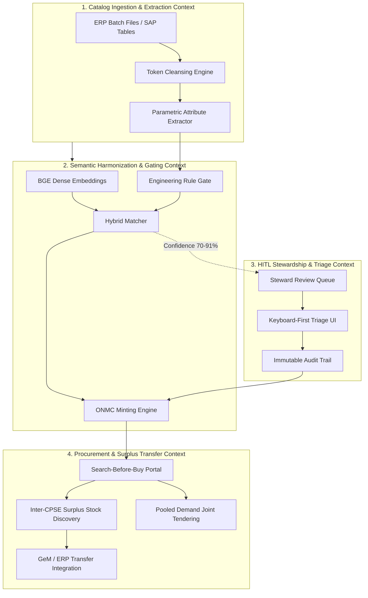

# Domain Model & Ubiquitous Language (CONTEXT.md)

## National Unified Material Master (NUMM) Framework

**Problem Statement**: SIH 26099 (Ministry of Petroleum & Natural Gas - MoPNG)  
**Standard**: One Nation, One Material Code (ONMC)

---

## 1. Domain Glossary & Ubiquitous Language

Consistent terminology across all services, databases, algorithms, and user interfaces:

### 1.1. Core Codification Concepts

- **Raw Material Record**: The unstandardized line item from a CPSE's legacy ERP system (SAP ECC 6.0, SAP S/4HANA, Oracle EBS). Characterized by abbreviated free-text descriptions (`MAKT-MAKTX`), legacy material numbers, and inconsistent units.
- **One Nation, One Material Code (ONMC)**: The sovereign, deterministic national material code minted by NUMM. Format: `ONMC-<DISCIPLINE>-<CATEGORY>-<TYPE>-<SIZE>-<PRESSURE>-<METALLURGY>-<HASH4>` (e.g., `ONMC-MECH-VLV-BAL-002-150-A105-9B2F`).
- **Shell MESC (Material and Equipment Standards and Code)**: The 10-digit international petroleum taxonomy structure (`XX.XX.XX.XXX.X`).
  - _Main Group 74_: Valves & Fittings
  - _Main Group 76_: Piping & Flanges
  - _Main Group 60_: Instrumentation & Control
  - _Main Group 27_: Mechanical Equipment (Pumps, Compressors)
  - _MESC SPE (Standard Purchase Equipment Specifications)_: Technical specs governing fabrication and inspection (e.g., SPE 77/300 for Ball Valves, SPE 77/200 for Gate Valves, SPE 74/019 for Piping).
- **UNSPSC (United Nations Standard Products and Services Code)**: Global 8-digit commodity taxonomy.
  - _40141600_: Industrial Valves (40141607 = Ball, 40141611 = Gate, 40141612 = Globe, 40141601 = Check)
  - _40141700_: Pipe Fittings (40141720 = Flanges, 40141721 = Elbows)
  - _31181502_: Spiral Wound Gaskets
- **Harmonization**: The complete end-to-end process of ingesting raw line items, extracting structured physical attributes, evaluating semantic and lexical similarities, enforcing engineering rule gating, and assigning or minting an ONMC identifier.
- **Duplicate Cluster**: A collection of two or more raw material items originating from one or more CPSEs that correspond to the exact same physical equipment specification.

### 1.2. Engineering & Metallurgy Terminology

- **Nominal Pipe Size (NPS)**: Imperial dimension designation for pipe and valve diameter in inches (e.g., 0.5", 2", 6", 12").
- **Nominal Bore (NB) / Diamètre Nominal (DN)**: Metric millimeter equivalent (e.g., 15 NB = 0.5", 50 NB = 2", 150 NB = 6").
- **Pressure Class / Rating**: ASME pressure temperature rating in pounds per square inch (`#`, `LB`, `LBS`, `CLASS`, `CL`). Primary classes: `150#`, `300#`, `600#`, `900#`, `1500#`, `2500#`. Metric equivalent: `PN` (e.g., PN 20 = Class 150, PN 50 = Class 300).
- **Metallurgy Grades**:
  - `ASTM A105`: Forged carbon steel for piping components and flanges.
  - `ASTM A216 Gr WCB`: Cast carbon steel for valve bodies and pressure casings.
  - `ASTM A106 Gr B`: Seamless carbon steel pipe for high-temperature service.
  - `ASTM A350 LF2`: Forged carbon steel for low-temperature service (-46°C).
  - `ASTM A182 F316 / F316L`: Forged austenitic stainless steel 316.
  - `ASTM A351 CF8M`: Cast stainless steel 316 equivalent.
- **End Connection & Facing**:
  - `FLANGED RF`: Raised Face flanged connection conforming to ASME B16.5.
  - `FLANGED RTJ`: Ring Type Joint flanged connection for high pressure/temperature.
  - `BW / BE`: Butt Weld / Bevel End conforming to ASME B16.25.
  - `SW`: Socket Weld conforming to ASME B16.11.
  - `NPT / THD`: National Pipe Taper thread conforming to ASME B1.20.1.

### 1.3. Enterprise & Regulatory Terms

- **CPSE (Central Public Sector Enterprise)**: Sovereign public sector oil & gas operators under MoPNG:
  - `IOCL`: Indian Oil Corporation Limited
  - `ONGC`: Oil and Natural Gas Corporation
  - `BPCL`: Bharat Petroleum Corporation Limited
  - `HPCL`: Hindustan Petroleum Corporation Limited
  - `GAIL`: GAIL (India) Limited
  - `OIL`: Oil India Limited
  - `EIL`: Engineers India Limited
  - `NRL`: Numaligarh Refinery Limited
  - `MRPL`: Mangalore Refinery and Petrochemicals Limited
  - `CPCL`: Chennai Petroleum Corporation Limited
- **GeM (Government e-Marketplace)**: India's sovereign procurement portal. Mandated under Rule 149 of the General Financial Rules (GFR) 2017 for all CPSE common-use purchases.
- **CVC (Central Vigilance Commission)**: Apex anti-corruption body mandating fair, non-discriminatory, transparent public procurement and auditable decision trails.
- **OISD (Oil Industry Safety Directorate)**: Safety regulatory body for the hydrocarbon sector in India:
  - _OISD-STD-118_: Plant layout and safety separation distances for refineries and installations.
  - _OISD-STD-141_: Cross-country hydrocarbon pipeline design and construction safety standards.

---

## 2. Bounded Contexts

### Context 1: Catalog Ingestion & Extraction Context

- **Boundary**: Ingestion of raw SAP/Oracle files and string cleansing.
- **Inputs**: `.xlsx`, `.csv`, or SAP RFC dumps (`MARA`, `MAKT`, `MARC`, `MARD`, `MBEW`).
- **Outputs**: `CleansedMaterial` entity with parsed attributes (`item_class`, `size_inch`, `pressure_class`, `metallurgy`, `end_connection`, `standards`).
- **Seam**: `IIngestionService`, `INormalizationService`.

### Context 2: Semantic Harmonization & Gating Context

- **Boundary**: Vector projection, candidate retrieval, and physical safety validation.
- **Inputs**: `CleansedMaterial` + Canonical `UnifiedMasterCode` catalog.
- **Outputs**: Match candidate pair with confidence score, rule pass boolean, and attribute deltas.
- **Invariants**: Size and pressure class must match 100% or candidate is disqualified.
- **Seam**: `IMatchingEngine`, `IRuleGate`.

### Context 3: Human-in-the-Loop (HITL) Stewardship Context

- **Boundary**: Data steward review of borderline similarity pairs (70% - 91% score).
- **Inputs**: `CandidateCluster` with visual delta highlighting.
- **Outputs**: Approved merge, manual attribute correction, or new ONMC code minting.
- **Invariants**: Every decision is cryptographically signed and logged with user ID, timestamp, and justification.
- **Seam**: `IStewardshipService`, `IAuditLogService`.

### Context 4: Procurement Discovery & Inter-CPSE Surplus Transfer Context

- **Boundary**: Pre-purchase requisition checks and joint CPSE demand pooling.
- **Inputs**: Purchase requisition draft from plant engineer.
- **Outputs**: Existing surplus stock located at sister CPSE warehouses within geographic proximity, or pooled tender batch.
- **Seam**: `IProcurementService`, `ISurplusTransferService`.

---

## 3. Domain Invariants (Non-Negotiable Business Rules)

1. **Rule of Pressure Non-Substitution (INV-01)**:
   A component rated at ASME Class 150 cannot be automatically harmonized or substituted with Class 300, Class 600, or any higher/lower pressure class without human engineering sign-off, even if all dimensions and metallurgies match.
2. **Rule of Size Equivalence (INV-02)**:
   Nominal Pipe Size (Imperial) and Nominal Bore (Metric) must resolve to exact standard dimensional equivalents (e.g., 2.0" = 50mm, 6.0" = 150mm). Non-standard interpolations are disallowed.
3. **Rule of Sour Gas / Metallurgy Segregation (INV-03)**:
   Materials specified for sour gas service (NACE MR0175 / ISO 15156) must never be unified with standard hydrocarbon service lines, even if basic ASTM chemistry is identical.
4. **Rule of Audit Immutability (INV-04)**:
   No catalog unification, master code deprecation, or cluster merge may occur without an append-only audit log entry preserving the exact pre-state, post-state, operator, and algorithmic confidence metrics.
