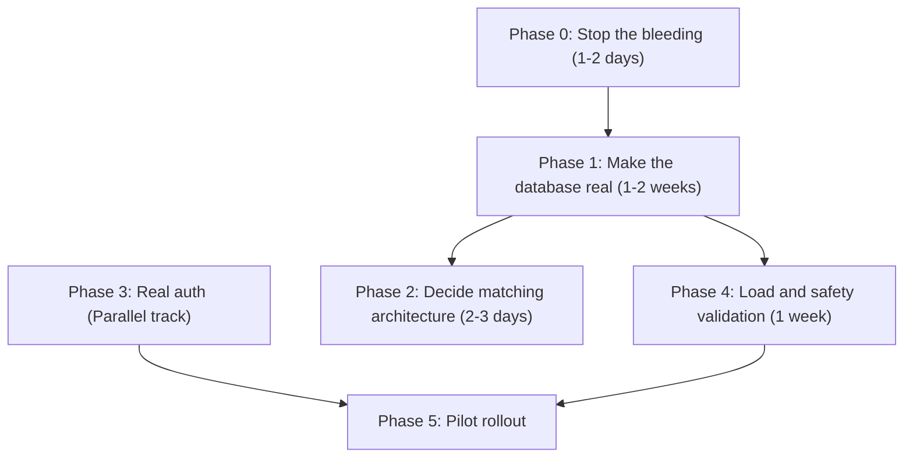

# Implementation Plan & Build Sequence (IMPLEMENTATION_PLAN.md)

## National Unified Material Master (NUMM) Framework

**Problem Statement**: SIH 26099 (Ministry of Petroleum & Natural Gas - MoPNG)  
**Standard**: One Nation, One Material Code (ONMC)  
**Version**: 2.2.0 (Engineering Reality-Grounded Plan)

---

## 1. Build Philosophy & Engineering Principles

1. **Ponytail Discipline**: YAGNI over aspirational architecture. Minimum complexity that achieves the objective. Standard libraries and direct implementations over convoluted layers.
2. **Evidence Before Assertions**: (Verification-Before-Completion) Every phase must be verifiably complete with hard evidence (tests passing, DB persisted) before moving on.
3. **Deterministic Safety Rules**: The ASME/API rules are the source of truth. Any ML/NLP components are subservient to deterministic safety rules. 
4. **Lean Build**: Focus strictly on the gap between the code review reality and a shipping product, cutting out PRD features that aren't on the critical path.

---

## 2. Six-Phase Delivery Sequence

### Phase 0: Stop the bleeding (1–2 days)
*Status: Completed*

- **Scope**: Security triage and critical configuration fixes before doing feature work.
- **Tasks**:
  1. `main.py`: Replace `allow_origins=["*"]` with an explicit allowlist from settings.
  2. Pull all default passwords (`numm_secure_pass`, `alembic.ini`'s hardcoded connection string) out of committed files into `.env` / secrets, and rotate them.
  3. `core/security.py`: Flip `HTTPBearer(auto_error=False)` behavior so routes are auth-required by default, with an explicit opt-out for `/health` only.
  4. Add `USE_SQLITE=false` as the required prod setting and fail startup loudly if Postgres isn't reachable.

---

### Phase 1: Make the database real (1–2 weeks — highest leverage)
*Status: Pending*

- **Scope**: Move every endpoint from module-level Python dicts to real, persistent queries.
- **Tasks**:
  1. **Ingestion → `raw_materials` / `cleansed_materials`**: `ingest.py`'s `_process_items_sync` must `INSERT` each parsed item via the async session instead of writing to `_INGESTED_RECORDS`. 
  2. **Embeddings → `material_embeddings`**: Generate and store the embedding vector per cleansed material once records persist.
  3. **Steward queue → `material_mappings`**: Replace `_TRIAGE_ITEMS` with a real query where `mapping_status='PENDING_REVIEW'`; `record_steward_decision` must `UPDATE` the row.
  4. **Search → `unified_master_codes` + `cleansed_materials`**: Replace `CANONICAL_MASTER_ITEMS`. Implement metadata filtering (exact `item_class`/`size`/`pressure` matches) before adding vector similarity.
  5. **Audit chain → `audit_logs` table**: `CVCAuditService._chain` must read/write the table instead of an in-memory list. The hash-chain-link logic survives restarts.
  6. **Demand pooling → `pooled_demands`**: Move from in-memory objects to actual database queries.
- **Verification Gate**:
  - Kill the server process mid-session and restart it. Every piece of data (ingested items, steward decisions, audit blocks) must still be there. 

---

### Phase 2: Decide the matching architecture honestly (2–3 days)
*Status: Pending*

- **Scope**: Formally resolve the disconnect between the docs and the code regarding deterministic vs. ML matching.
- **Decision Options**:
  - **Option A (Recommended)**: Keep deterministic attribute/lexical matcher as primary. Document it as the actual architecture and reposition BGE embeddings as an optional fuzzy-recall layer.
  - **Option B**: Wire in `sentence-transformers` + BGE, generate embeddings on ingest, and add real `pgvector` HNSW query as a first-pass candidate retrieval step before the safety gate filters.
- **Verification Gate**:
  - A written architectural decision record (ADR) or updated `TECH_STACK.md` that perfectly matches the executed code.

---

### Phase 3: Real auth (Parallel track)
*Status: Ongoing*

- **Scope**: True RBAC and SSO integration.
- **Tasks**:
  1. Kick off MeghRaj SSO onboarding conversation with NIC (institutional task).
  2. Implement real SAML 2.0 / OIDC token exchange in `meghraj_auth_service.py` behind a feature flag. Keep `/demo-tokens` working only when `ENVIRONMENT=development`.
  3. Apply RBAC role checks (`require_steward`, `require_procurement`) to every mutating endpoint, auditing `record_steward_decision` and MTIRF approvals in particular.
- **Verification Gate**:
  - `/demo-tokens` fails in production. Mutating endpoints correctly reject unauthorized roles with HTTP 403.

---

### Phase 4: Load and safety validation (1 week, after Phase 1)
*Status: Pending*

- **Scope**: Validate performance claims and safety constraints against real-world data volumes and edge cases.
- **Tasks**:
  1. Load-test search latency against a multi-hundred-thousand-row dataset in Postgres to validate sub-50ms p95 claims.
  2. Build an adversarial test set for the safety gate: near-miss sizes, unit ambiguity (`150#` vs `PN 20` vs `CL150`), and sour-service segregation.
  3. Re-run `verify_poc_and_tests.py` and `TEST_CASES.md` against the *database-backed* endpoints, not standalone functions.
- **Verification Gate**:
  - Load test metrics published. 100% pass rate on adversarial safety tests against live endpoints.

---

### Phase 5: Pilot rollout
*Status: Pending*

- **Scope**: Production deployment to pilot sites.
- **Tasks**:
  1. Deploy to four named pilot refineries (IOCL Mathura, ONGC Hazira, BPCL Mumbai, HPCL Vizag) per BG-02.
  2. Backup/restore drill: Execute documented `pg_dump`/`pg_restore` cycle before go-live.
  3. GeM API institutional access integration.
- **Verification Gate**:
  - Successful deployment to pilot sites and confirmed data restoration from backup.
