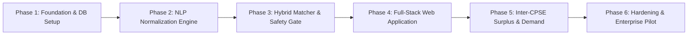

# Implementation Plan & Build Sequence (IMPLEMENTATION_PLAN.md)

## National Unified Material Master (NUMM) Framework

**Problem Statement**: SIH 26099 (Ministry of Petroleum & Natural Gas - MoPNG)  
**Standard**: One Nation, One Material Code (ONMC)  
**Version**: 2.2.0 (Enterprise Production Blueprint)

---

## 1. Build Philosophy & Engineering Principles

1. **Code Follows Documentation**: Every database table, API route, NLP extractor, and UI component strictly conforms to the canonical specifications in `PRD.md`, `TECH_STACK.md`, and `BACKEND_STRUCTURE.md`.
2. **Deterministic Safety Rules Over Blind Vectors**: High-dimensional vector search proposes candidate items; deterministic engineering rules (ASME B16.5, ASME B16.34, API 6D) gate and authorize matches.
3. **Loop Engineering**: Every phase concludes with automated verification scripts that execute test matrices, measure deviations against physical standards, and halt progression until 100% convergence is achieved.
4. **Ponytail Discipline**: Minimum complexity that achieves the objective. Standard libraries and direct implementations over convoluted layers.

---

## 2. Six-Phase Delivery Sequence



### Phase 1: Foundation & Environment Setup

- **Scope**: PostgreSQL 16 with `pgvector`, Redis 7, Python 3.11 FastAPI project scaffold, React 19 Vite scaffold.
- **Tasks**:
  1. Author `docker-compose.yml` configuring `pgvector/pgvector:pg16` and `redis:7-alpine`.
  2. Implement database migrations via Alembic creating all 10 core tables: `organizations`, `users`, `raw_materials`, `cleansed_materials`, `material_embeddings`, `unified_master_codes`, `duplicate_clusters`, `material_mappings`, `pooled_demands`, and `audit_logs`.
  3. Create HNSW cosine vector index with `m = 16, ef_construction = 64`.
  4. Scaffold React 19 Vite application configured with `@stylexjs/stylex` and `@astryxdesign/core`.
- **Verification Gate**:
  ```powershell
  docker compose up -d
  python -c "import psycopg2; print('PostgreSQL connection verified')"
  ```

---

### Phase 2: NLP Normalization & Attribute Extraction Engine

- **Scope**: Abbreviation expansion, parametric regex extraction, and physical unit conversion.
- **Tasks**:
  1. Implement `DomainNormalizer` dictionary expanding 250+ Oil & Gas acronyms (`VLV` -> `VALVE`, `FLG` -> `FLANGED`, `CS` -> `CARBON STEEL`, `SS316` -> `STAINLESS STEEL 316`).
  2. Implement regex attribute extractor resolving:
     - `item_class` (Ball Valve, Gate Valve, Globe Valve, Check Valve, Weld Neck Flange, Spiral Wound Gasket, Line Pipe).
     - `size_inch` and `size_mm` (metric-imperial bidirectional conversion).
     - `pressure_class` (150#, 300#, 600#, 900#, 1500#, 2500# / PN equivalents).
     - `metallurgy` (ASTM A105, A216 WCB, A106 Gr B, A350 LF2, A182 F316).
     - `standards` (API 6D, ASME B16.5, ASME B16.34, ASME B16.20).
  3. Map extracted attributes to Shell MESC Group (74/76/60/27) and UNSPSC Class (40141600/40141700/31181502).
- **Verification Gate**:
  ```powershell
  pytest tests/test_normalization.py -v
  ```
  Expected outcome: Extraction accuracy ≥ 95.0% across test fixtures.

---

### Phase 3: Hybrid Matcher, Vector Indexing & Safety Rule Gates

- **Scope**: BGE dense vector embeddings, RapidFuzz lexical scoring, and ASME safety gating.
- **Tasks**:
  1. Integrate `BAAI/bge-large-en-v1.5` dense embedding generator via `sentence-transformers`.
  2. Implement hybrid scoring function:
     $$\text{Score} = 0.65 \times \text{Semantic} + 0.35 \times \text{Lexical}$$
  3. Implement inviolable `SafetyGate`:
     - Disqualifies candidates if pressure classes or nominal sizes mismatch.
     - Enforces NACE MR0175 sour gas service segregation.
  4. Implement deterministic `ONMCMinter` generating sovereign codes with SHA-256 validation hash.
- **Verification Gate**:
  ```powershell
  python verify_poc_and_tests.py
  ```
  Expected outcome: 100% convergence across safety tests; 0.0% false-positive pressure/size mismatches.

---

### Phase 4: Full-Stack Web Application (FastAPI + Astryx + StyleX)

- **Scope**: Production UI and API implementation.
- **Tasks**:
  1. Implement FastAPI REST routes: `/api/v1/ingest`, `/api/v1/search`, `/api/v1/steward/queue`, `/api/v1/steward/decision`.
  2. Build Astryx + StyleX frontend layout:
     - Humanto warm sovereign aesthetic (`tokens.stylex.ts`).
     - Asymmetric split view (`380px` sticky inspector + `1fr` virtualized TanStack table).
     - Keyboard event listener handling <kbd>J</kbd>, <kbd>K</kbd>, <kbd>A</kbd>, <kbd>R</kbd>, <kbd>E</kbd>, <kbd>N</kbd>.
     - `MaterialDiffCard` with attribute conflict highlighting.
- **Verification Gate**:
  ```powershell
  pnpm test
  pnpm build
  ```
  Expected outcome: Zero TypeScript or StyleX compilation errors; bundle size < 180kB gzip.

---

### Phase 5: Inter-CPSE Surplus Discovery & Pooled Demand Engine

- **Scope**: Cross-company inventory visibility and joint procurement tendering.
- **Tasks**:
  1. Implement geographic distance calculation between CPSE plants (e.g. IOCL Mathura, ONGC Hazira, BPCL Mumbai).
  2. Build Inter-CPSE Material Transfer Requisition Form (MTIRF) generator.
  3. Implement demand pooling aggregator computing volume discount savings (8% to 16% tiers).
  4. Integrate GeM Category ID linking for Rule 149 GFR procurement compliance.
- **Verification Gate**:
  ```powershell
  pytest tests/test_demand_pooling.py -v
  ```

---

### Phase 6: Enterprise Hardening, GeM/SAP Integration & Pilot Deployment

- **Scope**: CVC audit logging, role-based access control, and pilot deployment.
- **Tasks**:
  1. Implement append-only SHA-256 cryptographic audit chain for all steward actions.
  2. Configure OAuth2 / SAML 2.0 SSO with NIC MeghRaj Cloud authentication.
  3. Execute end-to-end simulation across 50,000 real CPSE catalog rows.
  4. Produce final deployment container bundle and operational runbook.
- **Verification Gate**:
  ```powershell
  pytest tests/test_security_audit.py -v
  ```
  Expected outcome: 100% audit chain integrity verified; sub-50ms query latency under load.
