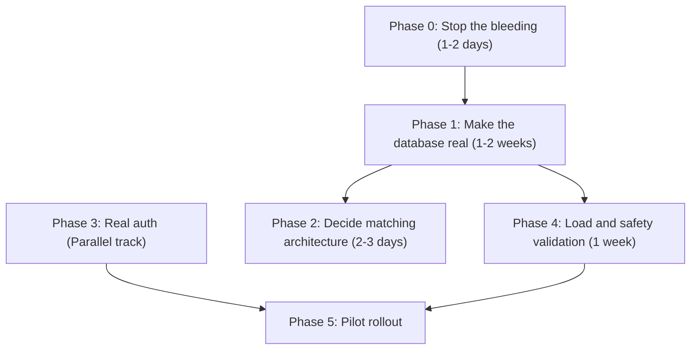

# Implementation Plan & Build Sequence (IMPLEMENTATION_PLAN.md)

## National Unified Material Master (NUMM) Framework

**Problem Statement**: SIH 26099 (Ministry of Petroleum & Natural Gas - MoPNG)  
**Standard**: One Nation, One Material Code (ONMC)  
**Version**: 2.2.0 (Engineering Reality-Grounded Plan)

---

## 1. Build Philosophy & Engineering Principles

1. **Ponytail Discipline**: YAGNI over aspirational architecture. Minimum complexity that achieves the objective. Standard libraries and direct implementations over convoluted layers.
2. **Evidence Before Assertions**: (Verification-Before-Completion) Every phase must be verifiably complete with hard evidence (tests passing, DB persisted) before moving on.
3. **Deterministic Safety Rules**: The ASME/API rules are the source of truth. Any ML/NLP components are subservient to deterministic safety rules.
4. **Lean Build**: Focus strictly on the gap between the code review reality and a shipping product, cutting out PRD features that aren't on the critical path.

---

## 2. Six-Phase Delivery Sequence

### Phase 0: Stop the bleeding (1–2 days)

_Status: Completed_

- **Scope**: Security triage and critical configuration fixes before doing feature work.
- **Tasks**:
  1. `main.py`: Replace `allow_origins=["*"]` with an explicit allowlist from settings.
  2. Pull all default passwords (`numm_secure_pass`, `alembic.ini`'s hardcoded connection string) out of committed files into `.env` / secrets, and rotate them.
  3. `core/security.py`: Flip `HTTPBearer(auto_error=False)` behavior so routes are auth-required by default, with an explicit opt-out for `/health` only.
  4. Add `USE_SQLITE=false` as the required prod setting and fail startup loudly if Postgres isn't reachable.

---

### Phase 1: Make the database real (1–2 weeks — highest leverage)

_Status: Mostly complete (steward queue/decision now DB-backed; ingest/search/audit/demand persist)_

- **Scope**: Move every endpoint from module-level Python dicts to real, persistent queries.
- **Tasks**:
  1. **Ingestion → `raw_materials` / `cleansed_materials`**: ✅ `_process_items_async` inserts via async session.
  2. **Embeddings → `material_embeddings`**: ✅ Stored per cleansed material on ingest.
  3. **Steward queue → `material_mappings`**: ✅ `GET /steward/queue` + `POST /steward/decision` update PENDING_REVIEW rows; FE cockpit wired.
  4. **Search → `unified_master_codes`**: ✅ Relational query (HNSW SQL still upgrade path).
  5. **Audit chain → `audit_logs` table**: ✅ Persist + verify.
  6. **Demand pooling → `pooled_demands`**: ✅ DB-backed.

### Phase 3: Real auth (Parallel track)

_Status: Partial — demo JWT + RBAC on mutations; live MeghRaj SSO still pending_

- ✅ `/demo-tokens` public (auth router exempt from global Bearer).
- ✅ FE role switcher loads persona JWT; `apiFetch` attaches `Authorization`.
- ✅ `require_steward` / `require_procurement` / `require_auditor` / `require_ingest` on mutating routes.
- ⏳ Real SAML 2.0 / OIDC with NIC MeghRaj.

---

### Phase 4: Load and safety validation (1 week, after Phase 1)

_Status: Pending_

- **Scope**: Validate performance claims and safety constraints against real-world data volumes and edge cases.
- **Tasks**:
  1. Load-test search latency against a multi-hundred-thousand-row dataset in Postgres to validate sub-50ms p95 claims.
  2. Build an adversarial test set for the safety gate: near-miss sizes, unit ambiguity (`150#` vs `PN 20` vs `CL150`), and sour-service segregation.
  3. Re-run `verify_poc_and_tests.py` and `TEST_CASES.md` against the _database-backed_ endpoints, not standalone functions.
- **Verification Gate**:
  - Load test metrics published. 100% pass rate on adversarial safety tests against live endpoints.

---

### Phase 5: Pilot rollout

_Status: Pending_

- **Scope**: Production deployment to pilot sites.
- **Tasks**:
  1. Deploy to four named pilot refineries (IOCL Mathura, ONGC Hazira, BPCL Mumbai, HPCL Vizag) per BG-02.
  2. Backup/restore drill: Execute documented `pg_dump`/`pg_restore` cycle before go-live.
  3. GeM API institutional access integration.
- **Verification Gate**:
  - Successful deployment to pilot sites and confirmed data restoration from backup.
